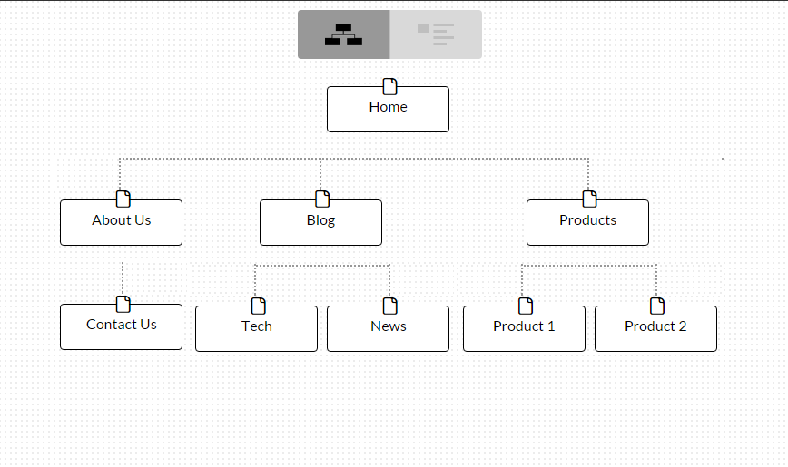

####What are the 6 Phases of Web Design?
  1) Information Gathering: This involves thinking hard about what your purpose for the site is, what your goals for it are, who your target audience is, and what kind of content the target audience will want to see.

  2) Planning: This involves creating a site map with all of the main topic areas of the site as well as sup-pages or topics. This is important for creating a site that is easily navigable.
  
  3) Design: This step involves deciding on the look and feel of your site based on the information you gahtered in step 1, and especially takes into account the target audience. This factore will determine the energy level, business, color scheme, and logos incorporated into the site.

  4) Development: This steo involves creating the actual architecture of your site beginning with the homepage. You will also need a "shell" that will be used to create all subsequent pages that can be accessed from the homepage in order to maintain consistency through your site as well as save time recreating the same page multiple times. Your content will then be added to the approriate locations within the site.

  5) Testing and Delivery: Testing is the process of actually testing the functionality of all the pages within it as well as all of the other functions such as scripts or forms to make sure that they work as intended. All of your code should also be validated at this point to make sure it conforms to current standards of web development and functions across all of the most commonly used browsers (cross-browser compatibility).

  Once Testing is finished, delivery involves uploading the website files to the server where it will be hosted. You will need to register a domain name and decide on a web-hosting service before this is done. Plugin installation and Search Engine Optimization should also be attended to at this time to maximize the site's functionality and accessibility.

  6) Maintenance: Once the site is launched, the maintenance step involves adding any new content, keeping things up to date with the current web standards, and making any other changes or additions you may want.

####What is your site's primary goal or purpose? What kind of content will your site feature?
  The primary purpose of this particular site will be to demonstrate my newfound web development skills by making a well designed, attractive, and informative site that functions well and is easy to navigate. The content will be about myself, and my skills, as well as my interests, new and interesting technology, and its applications. It will hopefully be a good place for others in the tech community to get to know me as well as for potential employers to easily find out more about me.

####What is your target audience's interests and how do you see your site addressing them?
  The target audience for thsi site will be people of all ages with an interest in web development, technology, programming, and possibly a few of my other interests such as video games and gadgets. The site will need to provide new and entertaining content in those fields in a way that they will find visually appealing.

####What is the primary "action" the user should take when coming to your site? Do you want them to search for information, contact you, or see your portfolio? It's ok to have several actions at once, or different actions for different kinds of visitors.
  The primary action for the user will be to read the content featured in the blog section, but if they are more interested in contacting me or reading my profile then links to those content areas will be easily accessible.

####What are the main things someone should know about design and user experience?
  The most important things to understand when creating a site are to understand your target audience and cater the site to them visually and topically while making the site easy to read and use.

####What is user experience design and why is it valuable? 
  User experience design entails creating a site specifically for the people that will be using it or who you think will be accessing it to the best of your knowledge. "The driving factor of how we build websites today has become the experience we want to give the people who will use the websites" (http://www.smashingmagazine.com/2010/10/what-is-user-experience-design-overview-tools-and-resources/). User experience is not inherently an easy thing to quantify or measure, so this makes the process a litle bit subjective but there are ways to improve a site to maximize its UX including consulting with a UX design professional or utilizing user surveys to find directly what the users of your site think about it.

####Which parts of the challenge did you find tedious?
  The actual assignment was rather simple at this stage of building the site. The most tedious part was anwering these questions which overlap in many areas and often lead to repetitive answers.

####My Site Map:
  