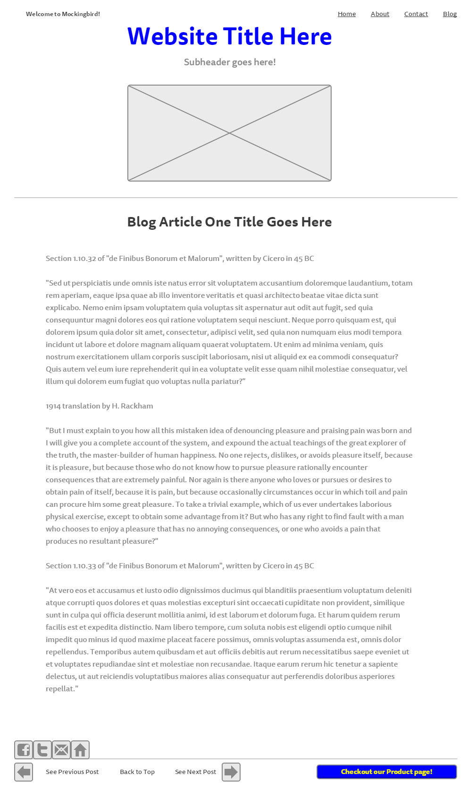

####My Wireframe:
  

####What is a wireframe?
  A wireframe is a basic outline of what a particular page on your site will look like when it is finished. This is diffwerent from a site map because it deals with the actual content and needs to be made for every page on your site. It includes things like relative size of the elements on the page, shape and alignment if different areas of the page relative to eachother and the location and size of any links, forms, buttons or images as well as the text.

####What are the benefits of wireframing?
  Wireframing is beneficial for the same reasons that an architect does not build a house without a blue-print or you don't go on a long road trip without looking up the directions first. It gives you something to help visualize the page as you build it and acts as a guide so you know where to put things, how large they are, in what order, etc. In an actual business setting it will also allow your client to see what the page to look like and give you feedback before you build an entire site that they don't like or approve of.

####Did you enjoy wireframing your site?
  This part of the process is actually pretty fun. I always enjoyed things like building with legos, or playing Simcity, and this is essentially the same thing. you get to move things around, play with the layout and structure of your site and see what you like best.

####Did you revise your wireframe or stick with your first idea?
  I did do some revision to get things the way that I liked them but on my trial account in mockingbird I am only allowed to creat one project so I used the same one on my week-2 folder as is in my github.io repo.

####What questions did you ask during this challenge? What resources did you find to help you answer them?
  This was pretty straightforward as far as the actual assignment goes. understanding where I was supposed to save the file and how many wireframes I was supposed to have made was a little confusing. In the directions it says "Add your wireframe images inline using markdown like you did in the last challenge." however, I was only allowed to make one single image on the wireframing site I used so I'm not sure if this is correct.

####Which parts of the challenge did you enjoy and which parts did you find tedious?
  I enjoyed the building of the wireframe. I found the saving and moving around of the file, and uploading it to be a little tedious.
